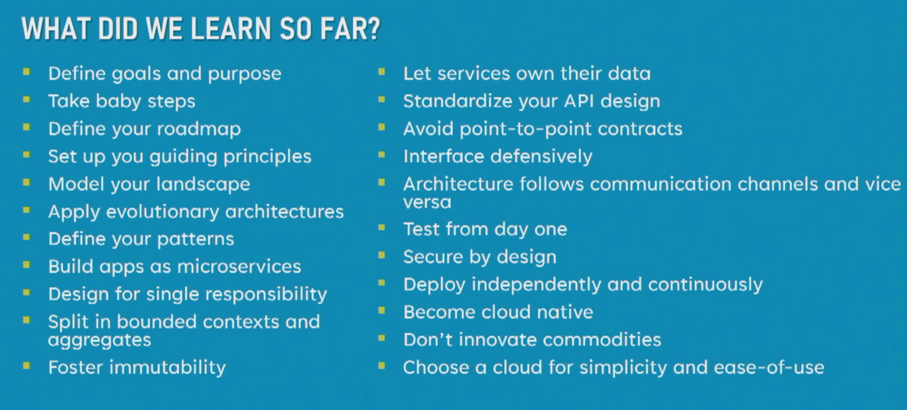
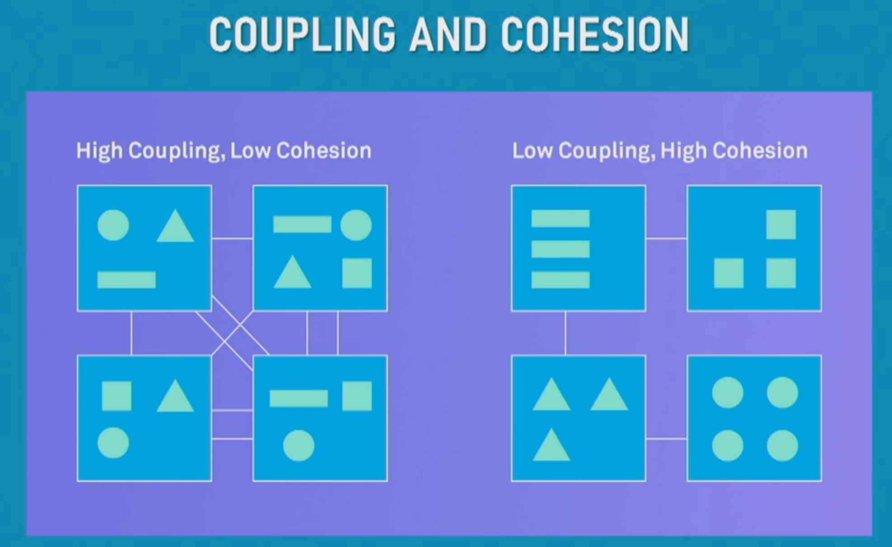
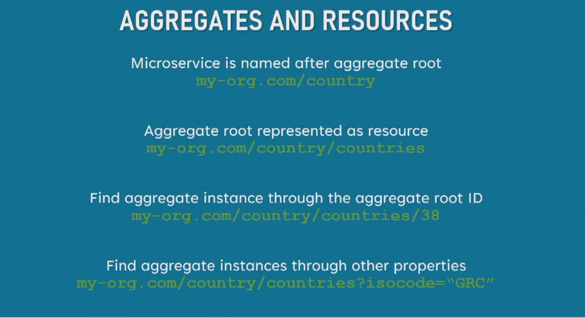
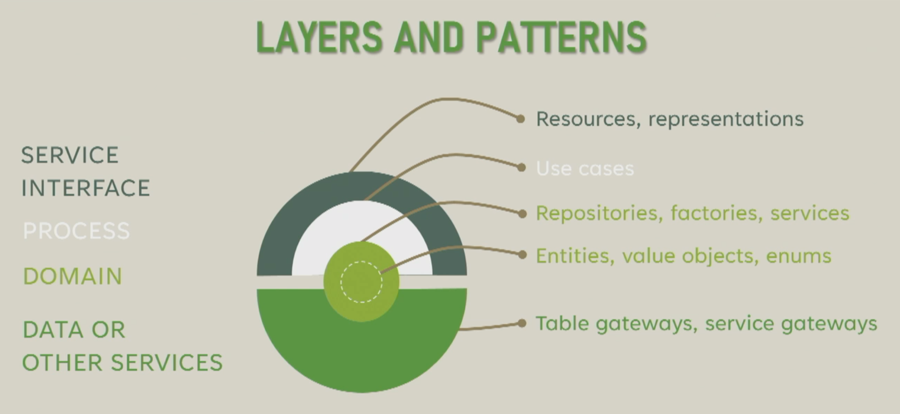
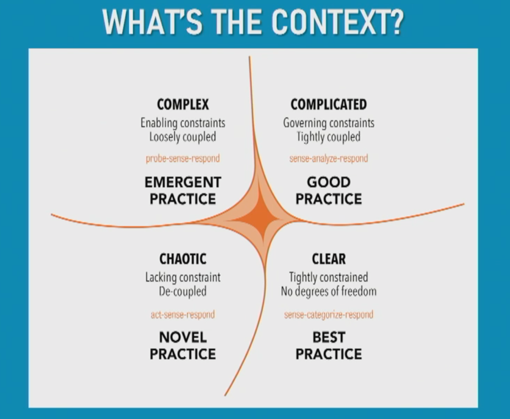
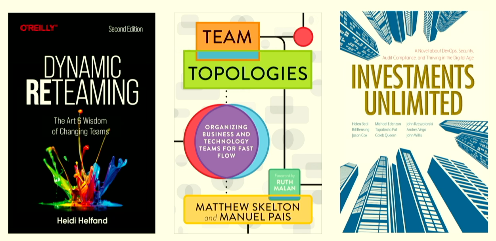
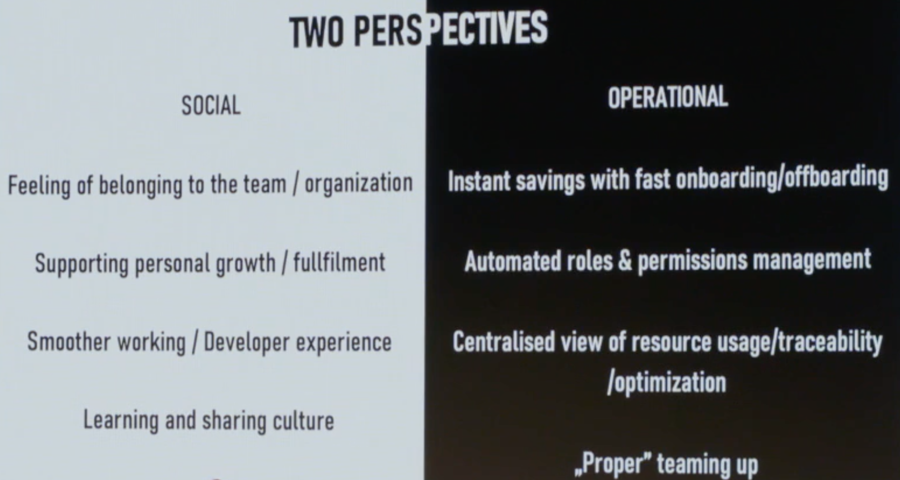

# GOTO 2022 Day 3

## Is Software Engineering Still an Oxymoron?

Alan Key, father of OO and Smaltalk

This key note is shared with GOTO Aarhus.

Engineering: designing repairing things in principled ways.
So that's what we do so it's not an oxymoron.
Use aspiration instead of oxymoron.
Aspiring to learn the Engineering of Software.

Bridge Building.
Starts with tinkering (knowledge I).
We have some aesthetics for what we like or not, knowledge II.
Engineering III.
Math knowledge IV.
And later science was the knowledge sharing device (knowledge V).

Where is software Engineering in this?
Has a bit of all.

Why didn't the internet cash ever?
Amazon did, Facebook did but the internet did not.
Designed not for success but design for failure.

> Asmomov's laws of robotics

Dunning-Kruger Syndrom: Estimated ability vs actyual ability.
Every human overestimated their abilities.

> Debugging is harder than programming.

Boeing disaster - artificial stupidity meets human stupidity, software is getting more and more involved.

People want to hear stories, buy systems are not stories.
As some point hour genetics was surpassed by our inventions.
The vector from this is the human wisdom which does not grow the same way.
We are terrible thinkers.

Doug Engelbart: augmenting human intellect - a conceptual framework (1962).
Pink brain given power will learn power not wisdom.
This is a dangerous way to learn power.
This can be mitigated by education.
Methods and Languages have to be known.

1968 - augmenting the collective intelligence of collaborative groups.

Showed a video of that there was some visual editing with a pen 60 year ago.
Most interesting systems are connected in a non-linear ways.

Programming systems do not need to be like hardware.
You can invent an ideal programming system and build it.
Ivan Sutherland, objects master & instances.
Interactive computer graphics and computer aided design.
Computer programming in term of 'what'.

CAD <-> SIM <-> FAB?
We can model turbulences to the atomic level.
We have CAD every where but not in software engineering.
We skip designing and simulating and mostly only fabricate.
Design <-> Simulate <-> Build.

Organization knows.
Organization does.
Organization does know.
Nobody knows.
What is actually needed.


IBM Autonomic Computing principals.
```
Book: Engineering a Safer world
```

Deep conservative pragmatism hold back the future.
```
Book: Thinking fast and flow
```

Expository Fiction: 
* System 1 quick via correlation. 
* System 2 slow pondering & rationalization.

What does out pink brain actually do?
When we see to things.
We see protons that goes though our brains.
Our brains does some magic.
But it might not be the reality.
We live in a wake dream.

We sometimes project thing from the inside to the outside - like religions.

Loss aversions: we won't get rid of old tools.
Cognitive bias.
Wikipedia the chart.
Some biases help us to focus.
In science you will always find what you are looking for - wrongly - confirmation bias.

Good ideas often don't scale to systems.

The Pledge of a real Engineer: The software must not harm or fail.

What ever we do, are we thriving to get better engineering.

```
Book: Software Engineering at Google
```
Software engineering at scale.
In software we often turn bricks into steel, which is not ideal.
We might better invent a much better programming language to handle the complexity.


## Microservices from the trenches. Concepts, design, architecture, code, testing.

Sander Hoogendoorn

Microservice Architecture.
Developing an application as a sum of individual services.

`@thisisagile/easy` opensource microservice framework.

Case: Insurance Company.
On premise main frame, running cobol and java.
Written in dutch and with a lot of abbreviation.
No one could read the code any more as their developers where retiring.
1. Figure out what's the actual problem.
Don't to it for the wrong reason.
Most time scaleability is not needed.
Plausable reason
1. Monolith are hard to drive, evolving get hard.
1. Huge tech stack.
1. Dependencies will kill everyone.
1. Data Sync.

The innovators dilemma, aka incumbent's curse.
Microservices can help here.
You gain flexability.

Be aware of Conway's law.
Silos.

Learn by doing.
Find your own way.

Lessons learned:
* Identify the dot on the horizon.
  Have a clear picture what problems need to be solved.
  Rough view on how to solve them.
* Take small steps.
  If you are in the complex zone there are no best practices.
  You have to experiment, but have a plan.
* Resolve knowledge silos.
  Inverse Conway maneuver.
  Build systems that enforces communication.
* Evolutionary architecture, the architecture needs to be adaptable.
  e.g. have the same general architecture for each service
  Domain, entities values object enum.
  Repositories, factories, services.
  Use cases, process.
  Resources.
  External services.

<p>

</p>

The domain.
Old patterns: low coupling, high cohesion.
Unix: do one thing that does one thing and does it well.
SRP.



DDD.
Bounded context: helps with large domains.
You wont be able to model a unified domain.
Model several models that have ubiquitous language.
Where one thing has only one meaning.

Aggregates: a group of associated objects.
Easier in no-sql databases.
Aggregate roots hold the reference to any aggregate object.



Split into bounded context and then into aggregates.
Matches REST well.
Aggregate root is a resource.

Entities. <skipped>



Services own their data.
This is required to resolve the implicit bound via db.
Use debezium to data sync.
This enables polyglot persistence.

Next CI/CD.
Will enable a high speed of change.
Small changes that can be easily brought into production.
How to?
Invest into CI/CD.
Build deploy to dev. 
Run API & Performance tests in dev. 
Deploy to prod.

Testing.
Manual testing must die.
The pyramid.
Unit, Api, Acceptance.
All starts with Unit Tests.

Quality built-in.
Cease dependence on inspection to archive quality.
A pipeline per app.

Manage pipelines automatically and as code.

You are not netflix.
Do it for the right reason.
Chaotic & Complex context.



1. Deliver small features
1. In even shorter cycles
1. With even smaller teams
1. In even smaller components

Solve a single problem per day.
Never stop learning.


## Structure and Interpretation of Test Cases

Kelvin Henney

Reminiscence of the SICP book.
There is more to test than having no more bugs.
Intentions.

> Programs must be written for people to read and only incidentally for machines to execute.

Same is true for tests.

```
Book: 97 Things every java programmer should know
```

What is a passing test telling us, what is a failing test tells us?
Failing test should tell us exactly what is the failure and the cause of it, so we do not need to spend a lot of time analyzing.
Each test should test one thing, can have several assertions though.

```
Book: Use Testing to develop better software faster
```

Use meaningful descriptive names.
Meaningful: don't describe what the test does, tell us why!
Never trust a test you haven't seen fail.
Timing is essential.
Not long after - not never.
Not short after.
Testing is a part of done.
TDD or ITL (Iterative Test Last).

Example: `leapYear(int year)`.
Implementation is not hard but the rule is unknown by most.
Explain why it works in the naming of the test.
Use a different naming notation (e.g. not camel case).
But the scenario in the test name.
Start with the easy things and build a story.
You could start with the biggest result set.
Use mutable exclusive categories.
Put happy path last.
Humans are bad with mixed boolean connectors.

Test must express required functionality to the reader.
Scope tests that will help with naming - give shape and structure.
Use nested classes/objects.
Use parameterization.

Organization:
* Common Cases
* Simple Cases
* Boundary Cases
* Error Cases

All can overlap - the tulip of test cases.

Coverage.
There are certain kind of coverage.
* Function coverage
* Line/statement coverage
* Branch coverage
* Path coverage - the most important

Same test can have a different coverage on different implementation.

What are the properties we are interested in.
Also add the reversed.

Structure + Interpretation = Programs.


## Design for the Utopia You Want, Not the Dystopia You're In

Chris Atherton

What do people do?
What do they do?
Who do we help people to do what they do?
How are people using it?

No design survives contact with the user.

How to respond?

The dystopia we have is different.
Technology is robbing is of agency.

Tech accelerated a lot.
Everybody got a megaphone.
`Can you believe this crap` become currency.
Attention has become a weapon.

Psychology.
It started by thinking about the nature of perception.
Hypotheses, test ,observe, rework, repeat.
*. Wiliam James - To how many thing can we attend to at once?
   There is no such thing as voluntary attention...

> Software that was meant be helful became thing we have to slap multiple times.

* Martin Seligman - learned helplessness. 
  Maybe you learn agency? 
  
> Why do I spend time figuring out how to logout...

Creepiness disguise as convenience.
Convenient for you might not be consent for some else.
Placebo agency.
Makes you feel you have agency, but you don't actually.

* B.F. Skinner & friends - Behavior and Reward.
  Reward = more behavior.
  Intermittent variable rewards.
  This makes people crazy.
  Metafilter, Hacker News...

* Hermann Ebbinghouse - Spaced retrieval.
  Practice in regular intervals make you learn better.
  Using the mobile phone is like practicing. 
  We practice arguing.
  Inaction is also a habit.
  Humans are bad at apprehending time.

* Gustav Fechner - Mere exposure effect.
  The idea just by being exposed to something you will like it more.
  Advertisement works like this.
  Overton window: the window shifts if more extreme is known - it become the new normal.
  Stockholm syndrom for network effects.

* Epictetus - quote...

No organization is this inept.
Some one proposed it. 
Someone agreed it. 
Someone built it.

```
Book: Ruined by Design
```

How can I act for users of I feel helpless?
I need to feel empowered.
I need empathy and mindfulness.

```
Book: Badass, make users feel empowered
```

Have a design system.
Do user centered design.
Specify the `Should not`.
Use white-hat bad actors.

Try to notice learned helpless.
Sometime refuse to engage.
Act for the utopia you want.


## In the pursuit of the best developer experience

Ivan Krnic, Kresimir Musa

Small organization is easy.
If you scale it gets harder.

> Companies above 1000 people will not need client at all.



```
Books: Dynamic ReTeaming, Team Topologies, Investments unlimited
```


Every improvement turns out as an additional check.
All these increase cognitive load.
Minimize intrinsic and eliminate extrinsic cognitive load.
Leave more space to germane cognitive load.

Developer Exp is not about feelings but about productivity.
The seamless experience.
Remove the friction.
See quarkus.


Take the whole developer journey into account.
From when he joins the company until he leaves.
Try to automate the touch points.

1. New Hires Coming in.
   Have a on-boarding buddy.
   How to ensure everybody get's a buddy.
   Have an on-boarding process that makes having a buddy explicit.

2. Hit the ground running on day one.
   All technical prerequisites should be ready.
   Gen-Z are very sensitive to friction.
   Lean software development process.
   Value adding activities.
   Value enabling activities.
   Non value adding activities.
   Automate permission granting.

3. People growing in the organization.
   Skills Map.
   Do it periodical.
   It's a conversation starter.

4. Teams Growing.
   
5. Team Changing.
   Permissions should be adjusted to team changes.

6. Teams Interact.
   Have a Team API.
   Team daily routine made public to the organization.

7. Security Officer
   It's hart to track elevated access grants.
   Activity log base on events.

Axon + klokwrk Framework is used for the internal developer platform.

8. Increase capacity.
   Increase head count will come at a cost.
   Look at github for behavior.
   Helps to potentially re structure teams.

Make teams small and they work simple.

<p>

</p>


## Welcome to a New Age of Refereeing

Pierluigi Collina

Why is the referee job difficult?
Decision making is difficult because
* Unclear situation
* Lack if time
* Pressure
* Consequences (some times a lot of money at play)

It will continue to become more difficult.

To face something bigger than you, you have to be prepared.

Preparation of referees is based on technology today.
It all starts with the physical preparation.
The referee also has to be an athlete.
Most times referees are way older than the players.
Use VO2 Max measurements to check fitness levels.
Use the lactate test to check how much lactate is produced.
Have a fitness plan custom fitted to the referee.

The task of the referee make sure the game is played by the rules.

Preparing with communication on a platform.

The winning advantage
* You need to be one step forward if you want to make a good decision.
* You need to get all the information.
* Know the characteristics of the players.

Semi-Automated Offside Technology.
* Track 29 data points of each player
* Tack the ball
* 50 times per second
* real time processed
* aids the VAR (Video assisted referee)
